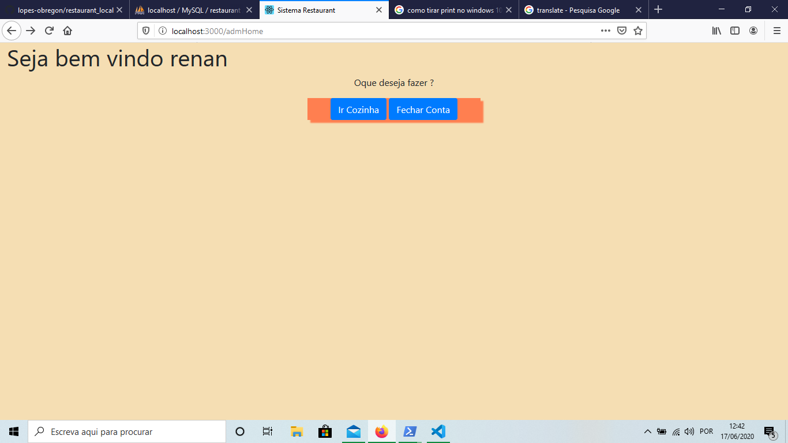
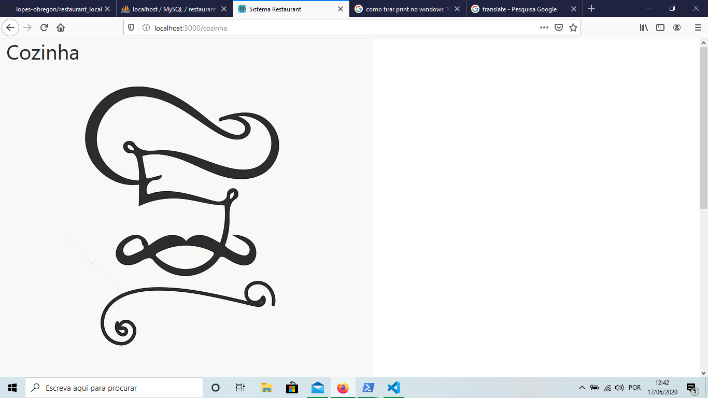
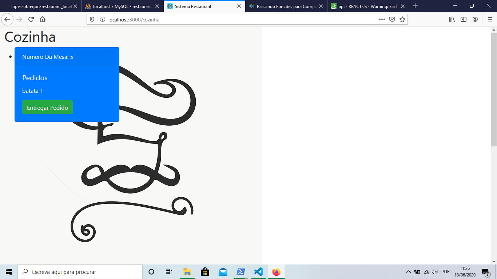
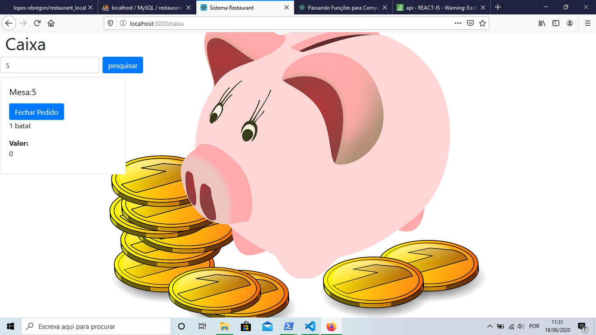
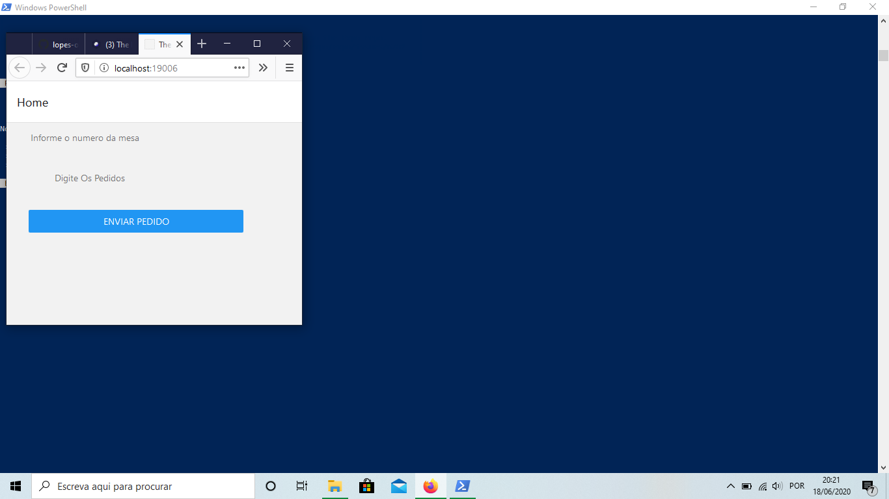

<h1>restaurant_local </h1>

restaurant management system with kitchen screens and cashier

<h2><b>attention:</b> you must have installed the mysql database and the  node.js for the system to function normally</h2>
<h3>the database should be made that way</h3>

bank name restaurant

<ol>
    <li>table name:<b>adms</b>
        <ul>
            <li>id</li>
            <li>user</li>
            <li>password</li>
        </ul>
    </li>
    <li>table name:<b>pedidos</b>
        <ul>
            <li>id</li>
            <li>pedido</li>
            <li>pedido_entrege</li>
            <li>mesa_ou_nome</li>
        </ul>
    </li>
    <li>table name:<b>produtos</b>
        <ul>
            <li>id</li>
            <li>nomeProduto</li>
            <li>valor</li>
        </ul>    
    </li>
<ol>
<h2>Screens</h2>
<h3>Login Screen</h3>

    

<h3>Adm Screen</h3>

    

<h3>kitchen Screen</h3>

    

    

<h3>Cashier Screen</h3>

    

    

<h3>Mobile Screen</h3>

    

